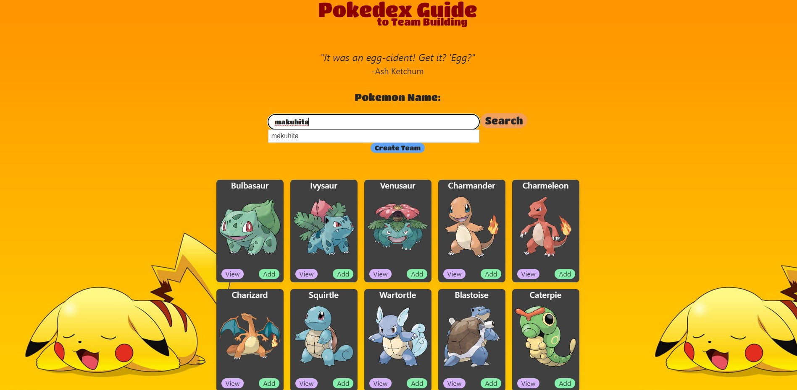

# Project 1 - Pokédex Guide to Team Building

## Description

Playing Pokémon for the first time can be confusing at times when it comes to what Pokémon to use for battle and getting a hang of what types are effective against others. The Pokédex Guide to Team Building is an application that users can refer to when building teams in various Pokémon games. Users can traverse through the directory and see every single Pokémon listed on the page as well as their types, strengths, and weaknesses, making it so that they can access information on any Pokémon at the drop of a hat.

## Usage/Preview

Users will be able to search for any Pokémon via the searchbar and will be met with the names of any Pokémon matching that input. The autocomplete allows users to fill in the rest of input. Users can then click the "Confirm" button to be brought to that Pokémon's respective card on the page, given that the user input was valid. The form also handles invalid searches and notifies the user if the Pokémon they are searching for does not exist.

Every Pokémon card contains a "View" button which, upon clicking, will open a modal that allows users to view more information such as the type(s), weaknesses, and strengths of that specific Pokémon.

Pokémon can also be added to create a team of 6, which will display at the top of the page for easy access and will persist through sessions via utilization of local storage. The Pokémon can also be removed from the team to allow users to create changes.

Live: https://linuscth.github.io/pokemon-index/

## Technologies Used
* jQuery
* jQuery UI for autocomplete feature
* Tailwind CSS
* PokéAPI for grabbing Pokémon information
* Animechan API for grabbing Ash Ketchum quotes
